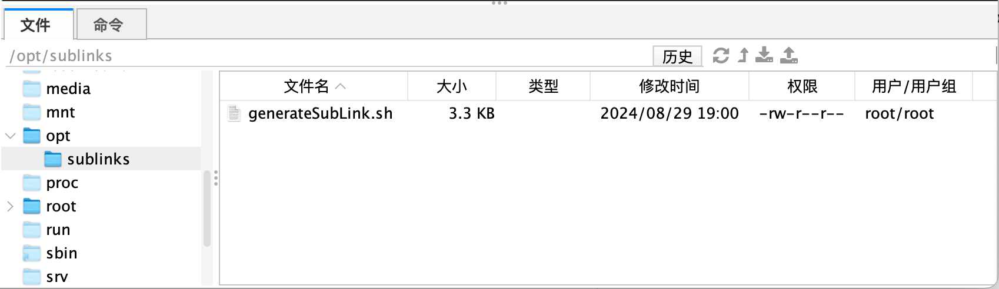
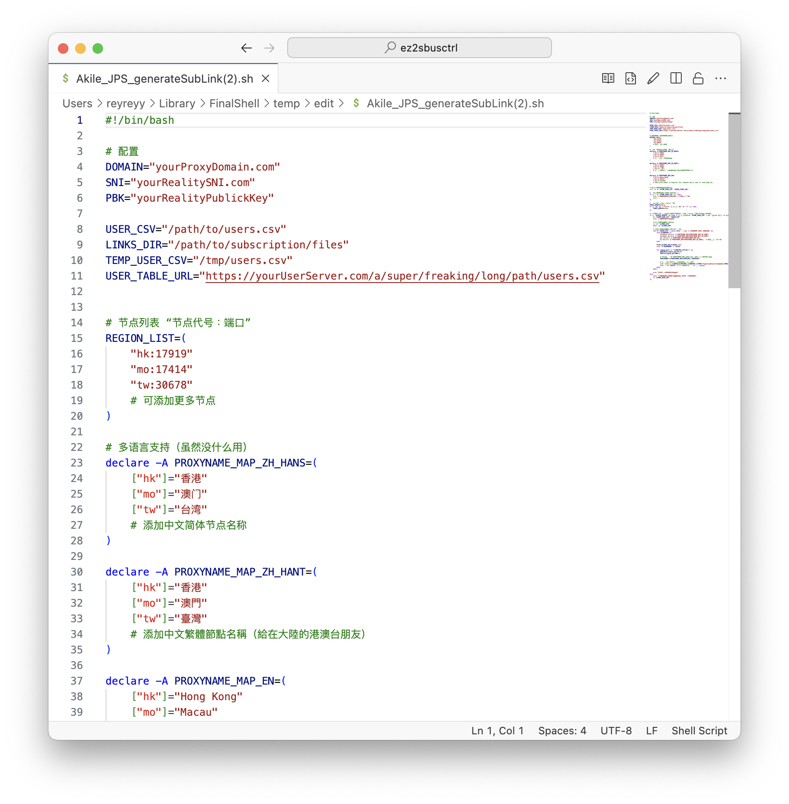
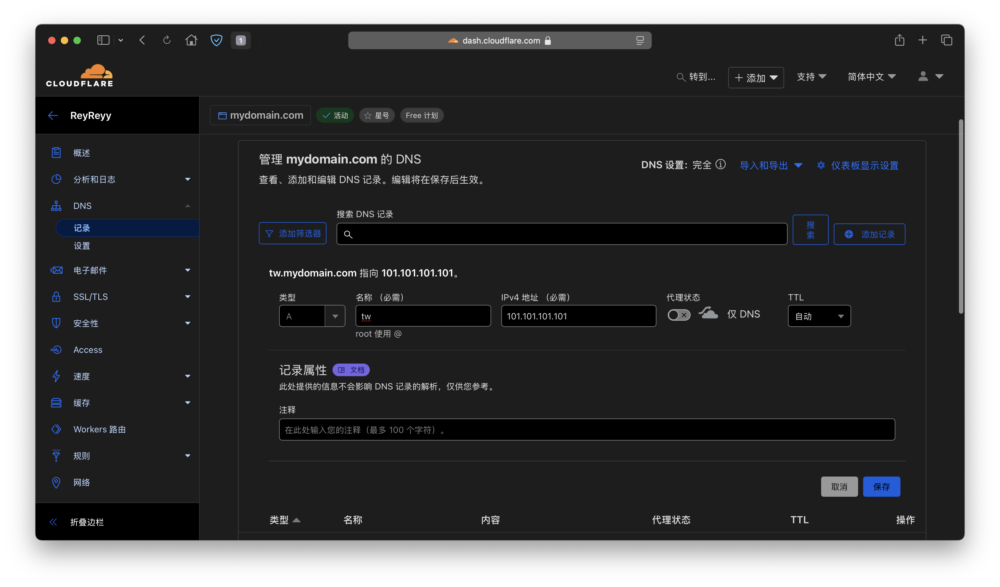
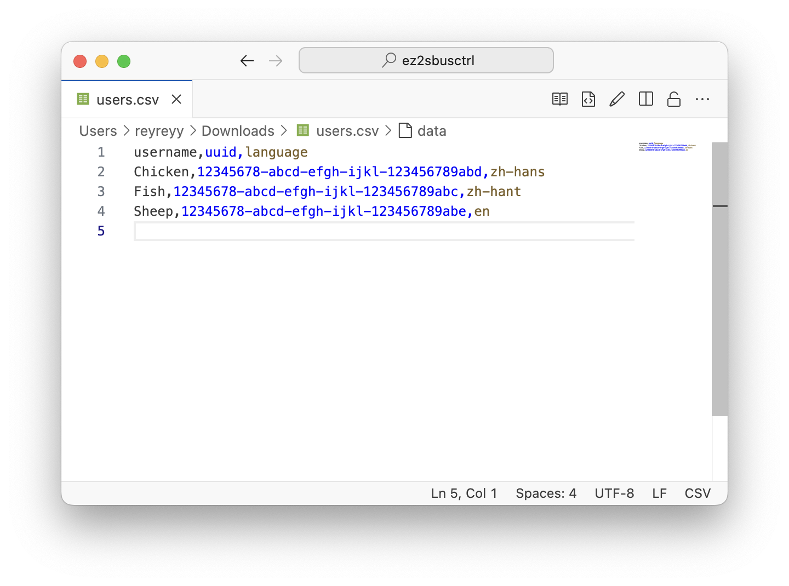
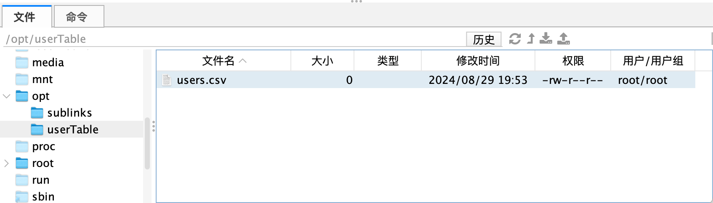
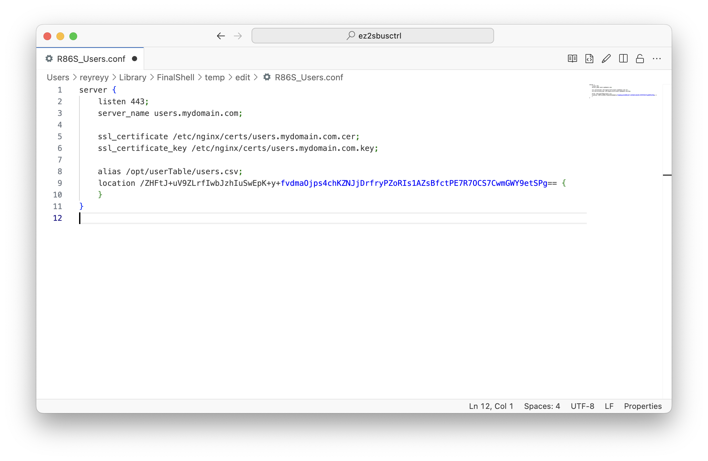
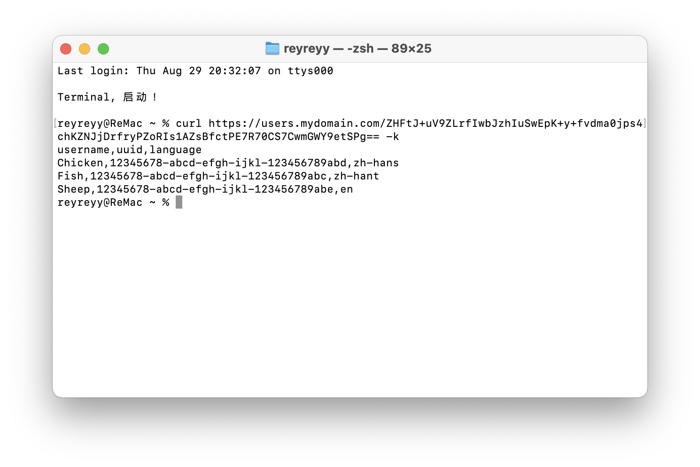
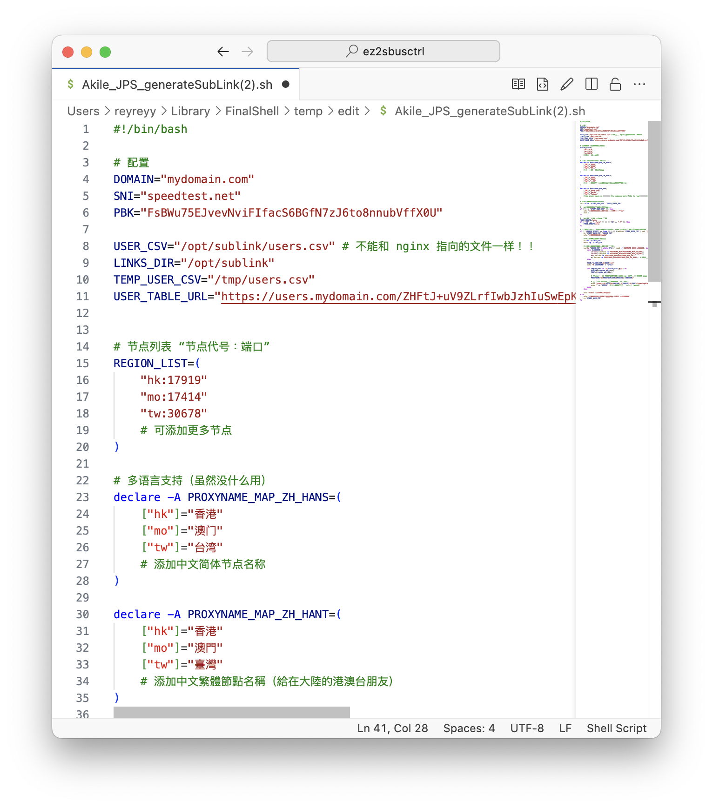

# 轻松控制 sing-box 用户配置。

众所周知，sing-box 是一个很好用的代理工具，有时候自己想做个大善人给朋友们用，总不能一个一个用户往配置文件里面去添加吧？既然是给朋友用，专门去搭建机场用的面板确实有点大材小用；虽然有现成的比如像是 mack-a 大佬的八合一一件脚本可以轻松添加/删除/更改用户，但是功能并仅限于单台服务器（节点）。所以我设计了这个脚本，用一个简单的 csv 文件来轻松控制所有 sing-box 用户。<br>

### 注意：此脚本还处于超级 Alpha 阶段，脚本可能会破坏你的 sing-box 配置，请谨慎使用！

## 如何使用

- 至少一台节点服务器
- 一台网页服务器（可部署在节点服务器上）
- 一个域名
- 一个不怕麻烦的心

### 配置订阅链接

**1. 在此仓库下载 `generateSubLink.sh` 至 whatever 哪一个目录。(以`/opt/sublinks`为例。)**


**2. 编辑 `generateSubLink.sh` 配置**



按自己的需要编辑配置。<br>

`DOMAIN`输入自己的服务器域名。<br>
`SNI`输入 Reality 协议需要的 SNI。<br>
`PBK`输入 Reality 公钥。<br>
`USER_CSV`填写你想放置用户信息的路径。<br>
`Links_DIR`填写你想放置订阅文件的路径。<br>
`TEMP_USER_CSV`填写下载用户信息的缓存路径。（可保持默认）<br>
`USER_TABLE_URL`先完成第 5 步，接着填入完整链接即可

然后编辑节点节点信息<br>

`REGION_LIST`填写你的`节点代号+端口`<br>
`节点代号`用于和`DOMAIN`生成子域名<br>
示例：

```
DOMAIN="myDomain.com"

#   ...

REGION_LIST=(
    "tw:5487"

)
```

输出子域名：`tw.mydomain.com：5487`<br><br>
当然可以不用区域代号当作域名<br>
比如：

```
DOMAIN="myDomain.com"

#   ...

REGION_LIST=(
    "test:8080"

)
```

输出子域名：`test.mydomain.com:8080`

**3. 绑定 DNS 解析记录**

登入你域名提供商/ DNS 解析服务商后台<br>
（以 Cloudflare 为例）



类型 A 填写 IPv4 地址；<br>
类型 AAAA 填写 IPv6 地址（如果有的话）。

以此类推，把你所有节点的 IP 地址绑定到对应的子域名

\*如果你之前就已经绑定好域名了，可以直接修改`节点代号`。

**4. 配置用户表，用来储存用户信息**

在你搭建的网页服务器上创建一个`.csv`结尾的空文件，或是下载仓库里面的`usersSample.csv`示例文件到网页服务器。<br>
**_用户表属于敏感信息，不建议储存在云服务器_**<br>
编辑`.csv`文件，添加用户配置信息:

格式：

```
username,uuid,language <第一行为标题栏，切勿更改
[名字],[UUID],[语言代码]
```

**5. 配置网页服务器**<br>

以 nginx 为例：<br>

我把`users.csv`文件放到`/opt/userTable`中<br>

再编辑 nginx 配置文件<br>

**_用户表属于敏感信息，切勿使用未加密的 http 服务器_**<br>
我把一串以 base64 组成的 url 路径指向`users.csv`文件，访问这个路径就会到达`user.csv`。<br> \*当然可以以别的路径指向这个文件，只要让别人猜不到路径即可。<br>

用`curl`命令测试一下<br>

可以看到已经测试成功了<br>

最后把完整链接填入`generateSubLink.sh`中的`USER_TABLE_URL`即可。

### 完整配置：



# 未完待续...
